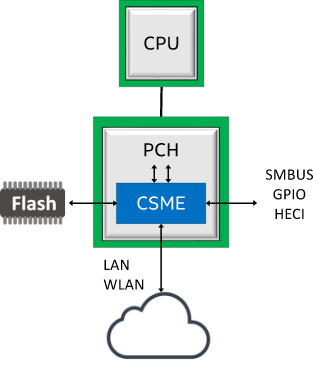
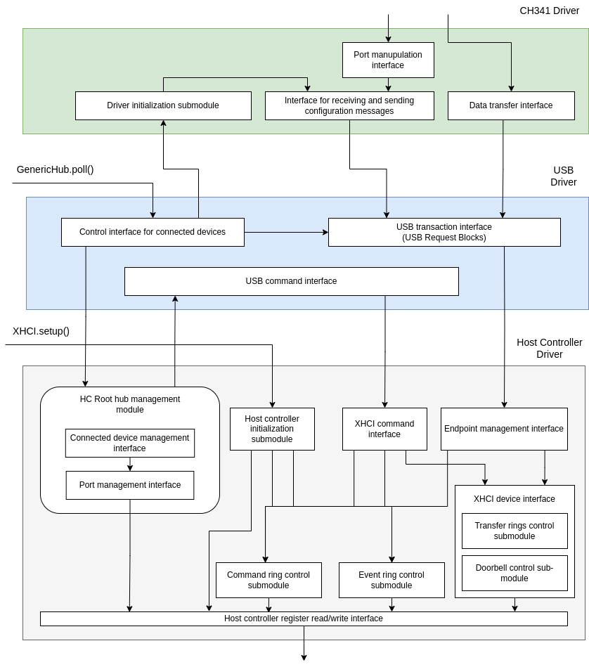
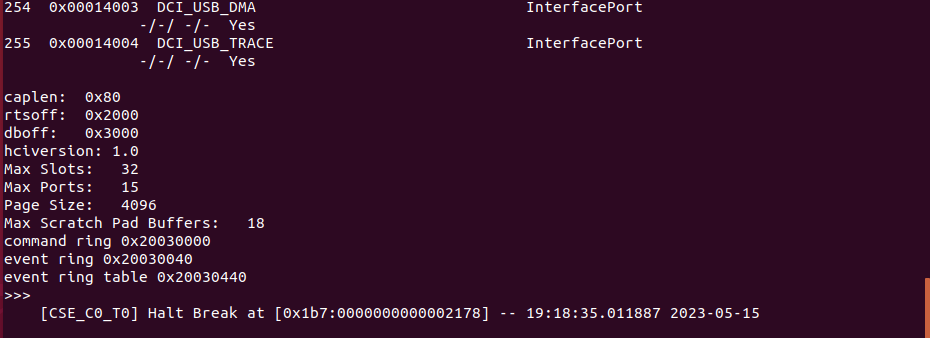
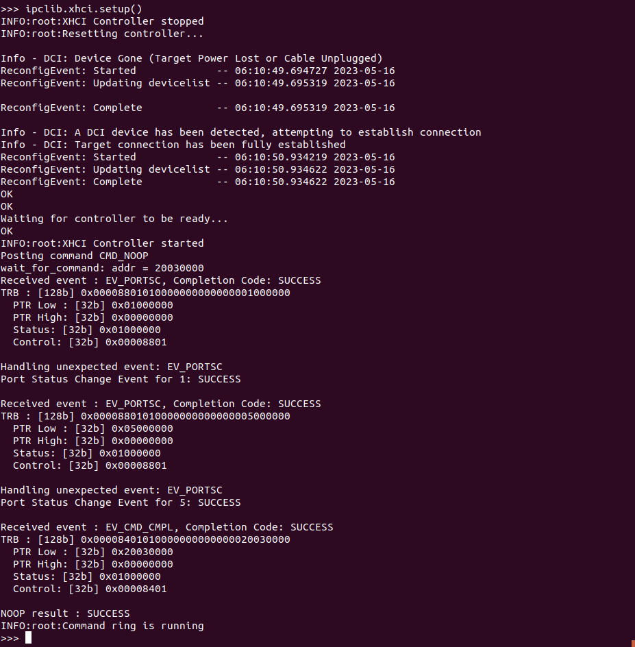
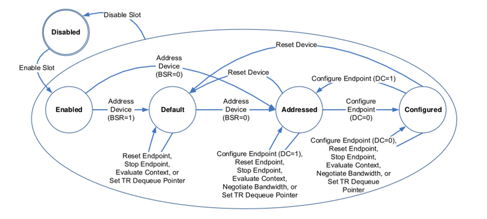
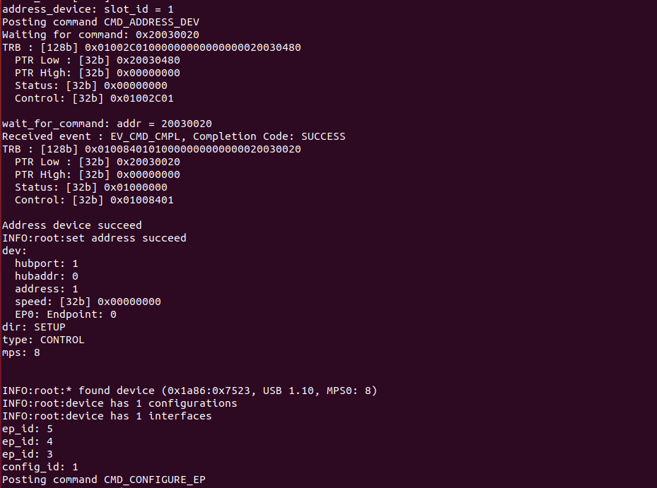
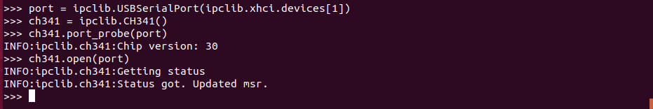
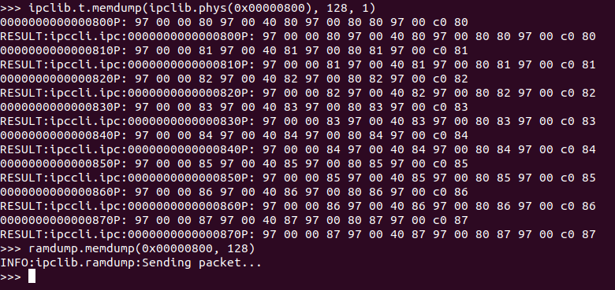
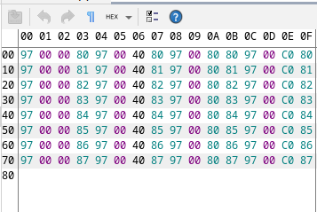

What if I tell that there could be a hidden side channel on your favorite Intel SoC or motherboard with Intel's chipset? Well, if you are an experienced security dev, you might just say "I know", cause the possibility of such channel has been advertised long enough: ever since the magic piece of tech a.k.a. Intel ME has been announced. But if it happens that you've never heard of such things as Intel ME and Intel CS(M)E, take a comfy chair and join the magical world of Intel Chipset technologies. For those who are scary security analysts indeed, here is the quick list of topics I gonna go through the article:

- What is Intel ME and what is it for
- Known security issues of Intel ME
- The prominent desire to leak the data through the Internet, and why it's not as easy as it could seem
- MITM attack on Intel SoC's Host Controller (XHCI)
- PoC on data leak through USB

## So, What is Intel ME?

Putting it simply, Intel Management Engine (Intel ME) is a piece of software and hardware embedded in Intel SoCs and chipsets in desire to provide special management capabilities (like remote management by Intel AMT) and implement a couple of security techs. Essentially, it is a separate full-pledged x86 processor on your motherboard or SoC capable of interacting with outer world on it's own. It turns on as soon as motherboard is powered and operates even when the CPU is down.

There is certain amount of names one may see in the Internet referring to Intel ME, so gimme a sec to describe what each of them about. Intel ME's hardware part is widely known as Intel Converged Security (and Management) Engine - Intel CS(M)E (exact name depends on the version of Intel SoC or chipset). So basically, it's a name for a processor in a PCH controller of your motherboard. The software part of Intel ME is called either Intel TXE or Intel ME (Intel TXE for Intel CSE, while Intel ME for Intel CSME). It is implemented as a MINIX micro-kernel loaded by Intel CSME from Flash BIOS chip.

Living the name-dropping aside, Intel ME is quite a powerful tech as one may notice. It leaves completely out of CPU view and only Intel knows what it might do. Since there were extremely low information about Intel ME at the time of its release, it has led to a great pushback from the community. While some people started to create [projects](https://github.com/corna/me_cleaner) which would purge Intel ME from their computers, others were seeking the truth.

## Positive technologies opens the gate

One of most significant among this many "others" were Positive Technologies - cybersecurity development company from Russia. A couple of their researchers spent years trying to investigate and describe the architecture of Intel ME. During such a wonderful journey they managed to decipher the configuration files of Intel ME bundled with debug software, described Intel ME Filesystem, modified debug software to allow support of Intel ME, and, last but not least, **hacked the Intel ME**.

On Black Hat Europe 2017 Positive Technologies [presented](https://youtu.be/9fhNokIgBMU) a description of INTEL-SA-0086 - a vulnerability inside Intel ME allowing to obtain high-privileged debug access to Intel ME. Maxim Goryachy and Mark Ermolov presented a demonstration of obtaining such access on Skylake platform and modifying video output on every boot stage using it. Quite impressive, to be honest.

Later, they released a [PoC for Apollake](https://github.com/ptresearch/IntelTXE-PoC) platform with instructions how to reproduce the issue. It is quite interesting why PT demonstrated the PoC for Skylake on Black Hat, but later released the PoC for Apollolake only. I suppose meme above explains it all.

Positive technologies published a lot of intel about Intel ME (excuse me playing upon words) describing which would need another article. Summing it up, Positive Techonologies let the community to take a closer look at Intel ME on its own. Thanks, folks.

## Public makes it own way

The situation about different PoCs presented by Positive Technologies on Black Hat Europe and on GitHub has catched an attention of Youness Alaoui (a.k.a KaKaRoTo). As he describes himself - "Software Engineer and entrepreneur". He set a goal to repeat PoC for Skylake and later published a series of articles on [his blog](https://kakaroto.ca/) describing the process of modifying PoC for Skylake. The tremendous work had to be done, including going deep into specifications of Intel chipsets, disassembling Intel ME's ROM, bruteforcing address space, and many more.

In [the last article](https://kakaroto.ca/2020/08/exploiting-intels-management-engine-part-3-usb-hijacking-intel-sa-00086/) of the series, he describes the idea how to implement an invisible keylogger using the Intel ME. Since Intel ME has full access to chipset's Host Controller (XHCI) responsible for USB devices connection, one may implement MITM attack using Intel ME. This would allow to monitor all the actions going back and forth between the platform and any of USB devices, including keyboard of cause.

Despite kakaroto describing the idea behind MITM attack very clearly, he didn't find time to finally implement it. He implemented the basic interfaces allowing one to access XHCI using python and retake control of XHCI from host OS, but that didn't go far than this.

## It's my turn to act

I've come to the supervisor of mine asking for a theme for thesis work, when he suggested me continue the investigation of Intel ME quirks. It took us a while to repeat the PoC presented by Positive Technologies. Kudos to the supervisor: I might got stuck there forever if not for him.

Bachelor thesis requires one to solve an engineering task so we've decided to create a dataleak channel through Ethernet connection. This requires to obtain access to GbE which I finally failed to do on mine board (GB-BPCE-3350). Later I've discovered notes in Intel Specification for Intel Celeron Series N that sideband channel seem to have no access to devices from other buses except 0. Unfortunately, GbE on GB-BPCE-3350 is located on a separate bus (2), which might be the reason why I failed to address it.

Nevertheless, the task has been set already, so there was no way back. Thus, it was decided to organize leak through USB channel.

## Lets stop speaking and make a PoC instead

As I said before, KaKaRoTo has only provided basic data structures and interfaces to interact with Host Controller (HC) registers. Therefore, I was doomed to implement USB stack from the very bottom.

To make the task doable in a time of one semester, I had to cut corners times to times. So lets announce a couple of assumptions about USB stack to be implemented:

1.  One don't need to receive any data from connected USB device, only send. This allows us to port only those functions from drivers which are related to write operations.
2.  One may safely ignore interrupt system. This allows us to port only those functions which are used in a polling mode of USB stack.

Thus, the following diagram illustrates the USB stack I have implemented. XHCI and USB drivers are heavily inspired by coreboot/libpayload implementation and are almost a literal translation of it to python language. The role of dataleak receiver is played by Arduino Nano, so it is CH341 driver which I had to implement. It is also heavily inspired, this time by Linux Kernel implementation. The source code of the following USB stack is available at [my fork of kakaroto's ipclib](https://github.com/Roo4L/ipclib).

Using interfaces provided by this USB stack, one may initialize XHCI structure, retake control of Host Controller from OS, poll attached deviced and initialize their drivers. Let's provide a little demo here.

### Retaking control of Host Controller

*Disclaimer: Obtaining access to Intel ME using Intel-SA-0086 (basically, replicating PoC by Positive Technologies) is left aside. One may find almost complete instructions in Positive Technologies repo.*

First of all, import ipclib as instructions say in the README. This should end with global `xhci` variable initialization which would handle all the data related to HC.

Well, we have launched python console and have imported ipclib successfully. What's next? Lets retake control of host controller from OS. This could be done using methods of global `xhci` object which already contains initialized constants related to HC. Use `xhci.setup()` to retake control, as presented on the picture bellow.

One may notice a major difference from the start with the screenshots presented by kakaroto. DCI connection is dropped right after issuing request for HC to reset. I have no other explanation than the difference of DCI protocol implementation on Linux and Windows versions of Intel System Studio. Nevertheless, connection drop doesn't affect in memory structures luckily, so one has to do nothing more than wait for a couple of seconds until DCI connection will be automatically restored. This is done automatically by `xhci.setup()` implementation of mine.

If controller retake finished successfully, one should see a SUCCESS response to NOOP command issued to HC, as presented on the picture.

### Polling attached devices

The next step is to poll attached devices. For this sake, `xhci.setup()` method also initalizes `xhci.roothub` structure which is simply a driver for HC root hub. Using it methods one my verify roothub port statuses, attach and detach devices and some more. `xhci.roothub.poll()` polls every ports 0 to 31 of HC and for any changes. If it finds an attached device, the device is connected according to XHCI specification.

In a few words, device connection requires certain subsequent calls to transition device from Disabled state to Configured. There is an illustration from XHCI specification which describes transition process.

The process is illustrated in the pics below.

Actually, there is a little lie. Despite me translating configuration stage code on python, I've never found enough time to test it properly. So I've replaced it with a hardcode which configures endpoints specific to my exact Arduino Nano. I have [an issue](https://github.com/Roo4L/ipclib/issues/3) in ipclib repository which references this exact problem. This might help one to notice the hardcode inside, but I suppose I would never fix it since I'm done here.

### Initializing Device driver

The last step in to load device-specific driver. As I mentioned earlier, Arduino Nano which acts as a receiver uses CH341 controller in order to connect with PC through USB Serial protocol, therefore it is CH341 driver which I had to implement. The implementation is presented on my fork of ipclib repository as well.

I was lazy enough, so driver loading is also done manually (instead of figuring out driver automatically using VID and PID). The process of loading CH341 driver is in the pic below.

Congrats, that's it. Now, one may send memory dumps or any other system information which they are interested in. For example, I've crafted a little protocol of mine, which transmits memory dumps, presented below.

## Conclusion

One may say, that this article presents no new vulnerabilities or capabilities of Intel ME so far. That would be 100% true. Truth is, security research was never been the goal of mine. I am rather a simple engineer which has wanted to solve an interesting engineering task.

That being said, article presents a simple and brief overview of a research related to Intel ME, outlines what has been done in practice in public before, and extends the work by implementing a modest USB stack capable of transmitting information through USB channel. Nevertheless, the MITM attack described by kakaroto is [yet to be implemented](https://github.com/Roo4L/ipclib/issues/2).

Implementing a USB leak was not the only task I've tried the accomplish, so I have a little more Intel I can share about Intel SoC architecture and replicating PT PoC. I hope to do in the next article of the series. By now, I hope you found this article interesting enough. Thanks for reading, the fellow traveller.
