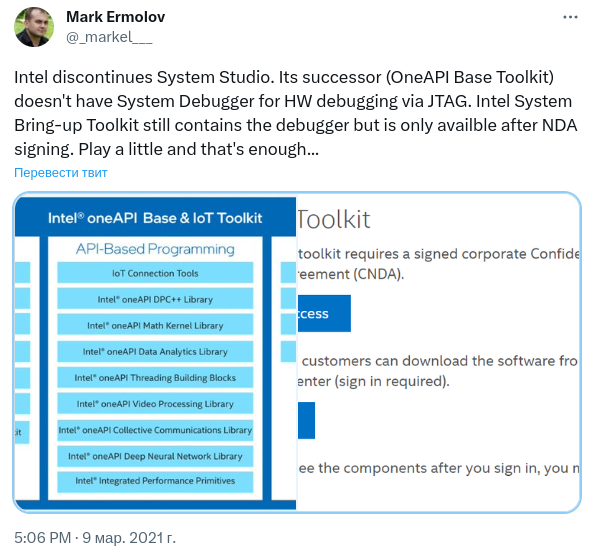
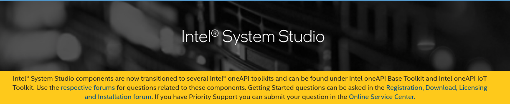
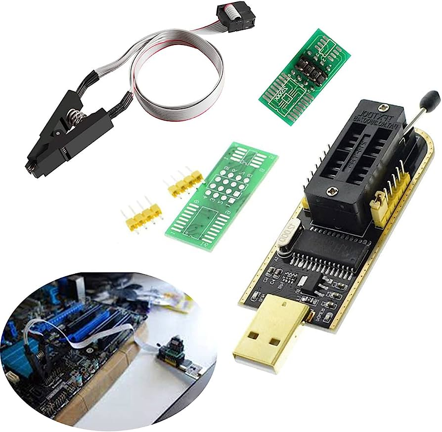
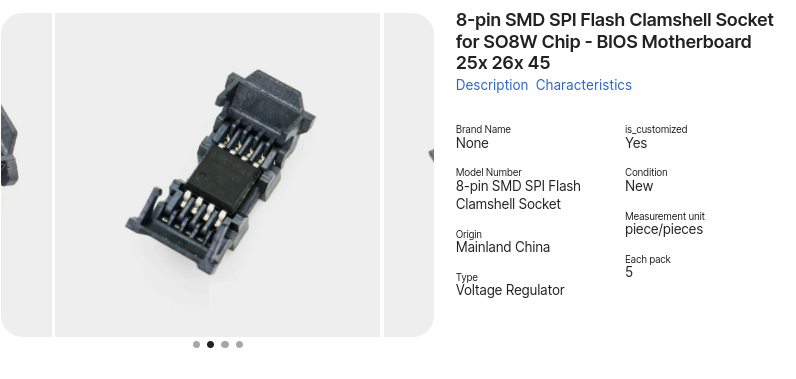
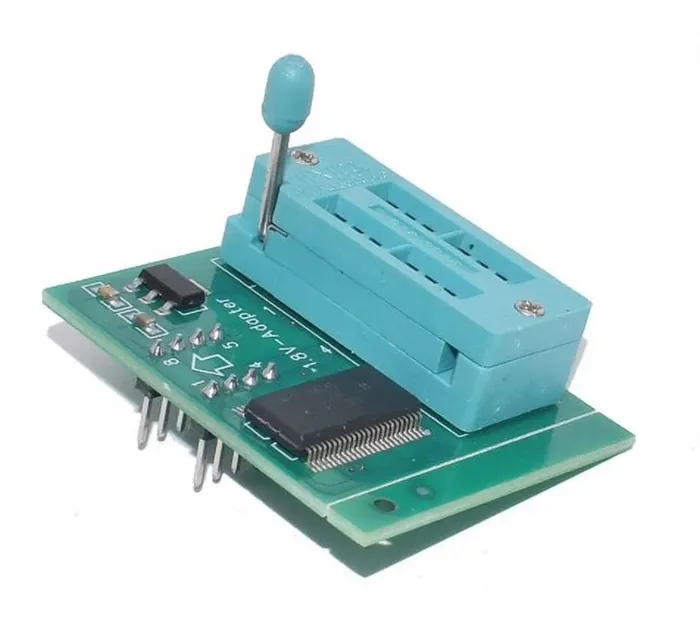

Contents:

- Obtaining Intel System Studio in 2023
- Resolving quirks with repeating PoC without BU CPU
- Writing Flash Images using CH341A programmer
- The quirks of USB debug cables and what one may need to understand about them
- Quirks of bringing up the CPU

In the introductory article of this series I said that almost complete instructions on how to reproduce PoC and obtain RED access to Intel ME through DCI could be found in the Positive Technologies' repository. This particular phrase of mine was a little bit of lie, actually, which even displeased my supervisor. In fact, the PT's repository omitted some details which might cost days or weeks of wasted time. There are also some changes in Intel's development tools which is also frustrating enough. So, let me contribute a piece of information to the PT's guides and save you from some torture.

DISCLAIMER: I suppose that you have read the PT's manual before moving the guide of mine. A lot of steps are quite similar, so instead of writing my own guide from scratch I would frequently reference parts of PT's guide.

## Intel System Studio is dead

The first thing PT start their guide with is the list of software one needs to repeat the PoC. One of the most important items in the list is Intel System Studio. It is special piece of software for developers who work closely with Intel silicons. The problem is that Intel has moved to a different set of tools since 2021 called Intel oneAPI which lacks important libraries used in the PoC such as OpenIPC.

Intel removed download links to any of Intel System Studio versions. Any threads regarding questions about Intel System Studio seem to be closed.

So, can one obtain Intel System Studio in 2023 anywhere? Even though most of the links pointing to Intel System Studio seem to be pretty well cleaned up, one can still find download sources just simply searching in google. I am too scared to provide any direct links to such sources, but I can give a small hint about it: look at the sources from jurisdictions being in rebellion with the rest of the world.

The only problem left is to activate the software obtained from such sources. At least in my case, the software was distributed without any activation keys attached. Luckily, Intel didn't revoke licences issued before transition to oneAPI. So, I suppose you know what to do. :)

## Programming BIOS Flash

Another important step in reproducing Positive Technologies' PoC is rewriting BIOS Flash with a modified image. I consider this process pretty hard for a newbie 'cause it is not so well documented in the web, contains a lot of quirks, and related to direct hardware manipulations. Basing on my experience, it took one burnt computer and an experienced supervisor to pass through this. So let's figure out all peculiarities one by one.

The first non trivial thing is how to connect to flash chip. There is a common approach widely used by hardware developers related to using a special programming pin and Flash programmer. However in my case, pins on motherboard were too small so it was almost impossible to wire flash chip reliably.

Thus my supervisor suggested an another approach related to desoldering flash chip and soldering special clamshell which allows to easily plug flash chips. This approach was chosen also because further research might include an often flash chip rewriting, which is much easier with clamshell instead of a pin.

The next thing worth talking about is assembling the programming sandwich. The first and foremost is a CH341A programmer. It is a main utility used for programming SPI Flash chips. I think it is pretty easy to find one on the internet and the appropriate Windows drivers to work with it. CH341A drivers are included in Linux kernel since 2.6.24.

The next crucial part of programming stack is a voltage converter. It happens that common CH341A programmers are working on higher voltage that some flash chips are designed to work with. As I see, common CH341A programmers are using 3V on read/write operations. To verify what voltage you chip is working on check out the flash chip name on the front and try to search its datasheets. In my case, Gigabyte Brix GP-BPCE-3350C uses Macronix MX25U12873F. According to datasheet, it requires 1.8V, so 1.8V adapter was the one I was looking for.

The upper layer in this sandwich is an adapter which would allow inserting SPI Flash chip. It could be found by the magic keywords "SOIC8/SOP8 to DIP8 adapter".

The last but not least is the software used to program the chip. There is a wide variety of programs on the internet which could be used to program flash chips, but the one that I sticked to was NeoProgrammer. First of all, it was capable of correctly identifying the flash chip model of mine. Second, it has a convenient interface which allows you to do three main operations: clear, write, verify. This is workflow I usually used during chip programming which allowed me to eliminate all the doubts about data uploaded to the chip.

## Quirks with repeating PoC without bringing up the CPU

The next issue on my list is repeating the PoC without bringing up the CPU (BU CPU). Repeating the PoC without BU CPU might look like an easier task from the first glance, and it is in indeed. However, latest version of PT's repository seem to be poorly tested without BU CPU, causing inability to repeat the PoC.

Luckily, I am not the first struggling with the issue. There is [an issue](https://github.com/ptresearch/IntelTXE-PoC/issues/11) on PT's repository describing the exact problem. The answer is pretty surprising: check out to [34af403](https://github.com/ptresearch/IntelTXE-PoC/commit/34af403e3ff0f0378d08f052c170388851131279) and use `me_exp_bxtp.py` from that version.

## Instructions on connection through USB debug cable

Important part of the PoC reproducing is establishing DCI connection through USB debug cable. Even though the technique is widespread and there are some guides on the internet about it, unprepared mind might still stumble upon tricky things and questions. Therefore, I am trying to give a minimal required information to perform the PoC.

First of all, lets overview what is Intel DCI itself. Direct Connect Interface (DCI) is a debug transport technology developed by Intel to debug it's hardware through a USB port. It is basically a convenient way to obtain JTAG access through USB connection. (It is capable of more than JTAG run control, but lets leave it aside.)

In order to establish such connection 3 requirements should be satisfied:

1.  Target host should be an Intel platform with DCI module on it. (Refer to specification, but I believe that every Intel-based platform should contain it by now).
2.  Host platform should have a special software which would issue DCI requests to target platform (in our case, it is OpenIPC library from Intel System Studio which we rely on).
3.  Host platform should be connected to target using USB 3.0 Debug cable **through USB debug ports**.

First and second requirement are easily satisfied and should not cause any troubles, so lets take a closer look to requirement №3.

### USB debug cable

First of all, what is USB 3.0 Debug cable. Basically, it is a casual USB 3.0 cable with isolated D+, D-, and Vcc contacts. Positive technologies [suggests](https://github.com/ptresearch/IntelTXE-PoC#preparing-the-usb-debug-cable) removing pins on one of the ends. I don't find this approach convenient and reliable. It is quite hard to remove pins in the middle: the risk of damaging or short-circuit other contacts is high enough. Therefore, I suggest breaking wires directly, even though it can potentially affect shielding and transaction speed. In any case, one should test the wire with the multimeter after the modification.

Also, it turns out that not every USB 3.0 cable is the same. For example, there is a quote from one of "USB 3.0 Super-Speed A/A Cable Crossover" [description](https://www.datapro.net/products/usb-3-0-super-speed-a-a-cable-crossover.html):

> While the USB 3.0 spec only calls for the USB 3.0 pins to be connected in cross-over, this cable also has the USB 1.1/2.0 pins connected straight-through. This makes it backwards-compatible with our 1592 USB 2.0 cables, but also means that it may cause damage if used for debugging or device-to-device connections.

So, I suggest you check your USB cable specification before making it a debug cable.

Another peculiarity about DCI connection through USB debug cable is the dependence of connection stability on the length of cable. It turns out that large enough cables are not capable of providing reliable debug connection. The first cable which was used for debug was 1.8m long and caused strange behavior during an attempt to establish debug connection on Windows. Therefore it was replaced with a shorter one, around ~0.5m long, and the problem was gone. A quick search on the special debug cables showed that there are no debug cables on the market longer than 1m, so I suppose it is a maximum debug cable length for the reliable connection.

### USB debug ports

Now about mysterious USB debug ports. It happens that not every USB port is sufficient for establishing DCI connection. I don't think it's needed to discuss the reasons for it, so let's just face it as it is. The question is how to identify whether your platform has USB debug ports and which of them are the one.

First way is to use one of Windows/Linux utilities to find information about which USB ports are debugable. For example, [here](https://learn.microsoft.com/en-us/windows-hardware/drivers/debugger/setting-up-a-usb-3-0-debug-cable-connection#set-up-the-target-computer) is Microsoft's guide on how to find out which USB ports are debugable. This approach is quite easy but requires one to be able to launch target platform. This might not be possible sometimes (for example, if you already rewrote BIOS Flash without BU CPU), so the second approach is for you.

Second way is to refer to platform specification. While this way could seem more convenient from the first glance, it is more obscure than the first one. *UsbView* said that all four ports on my Brix are debugable, while [specification (3.8 USB Controller)](https://objects.icecat.biz/objects/mmo_33208988_1485292404_8474_3259.pdf) states that only port 0 and port 1 could be used for DCI. So,

- Which one are port 0 and port 1? Specification doesn't provide that info, while in UsbView I was able to identify which port is which (subsequently inserting usb device). Also, UsbView numerated ports from 1 to 4, so there was no such port 0.
- If I'm not mistaken, experiments proved information from UsbView: I managed to establish DCI connection through any port. Either I have a faulty memories or each side of the board was containing a hub instead of actually providing dedicated USB channels.

## Quirks of repeating PoC with BU CPU

While repeating the PoC without BU CPU might be difficult to the issues in PT repository I've mentioned above, repeating PoC with BU CPU is not easier at all. The main reason behind bringing up the CPU is to boot into the target's OS and remain successful operation as if nothing was changed (or at least pretend), but is it really possible if one is interrupting normal operation of Intel ME? Let's figure it out.

Quick answer: yeah, it seems possible. At least, Positive Technologies claims so. In there presentation from Black Hat Europe 2017 they provide [a demo](https://youtu.be/9fhNokIgBMU?t=2010) of rewriting video output on every booting stage including login screen of OS. At the same time, they didn't share any scripts or guides to repeat the same impressive result. Therefore, one have to figure this out on their own.

Speaking of what I've been able to figure out: there is not much. First of all, I tried to resume boot process (by choosing Windows entry in boot menu) right after importing kakaroto's `ipclib`. Boot would either end up on the blank screen or come back to the BIOS menu after timeout.

Then, I've understood that kakaroto's library halts Intel CSE core, which seem to be somehow involved in a boot process. Therefore, I tried to resume Intel CSE's running thread and boot into OS. The result seemed to be pretty the same with the first one.

Exploring functions in kakaroto's `ipclib` I've also found some with pretty interesting names such as `reset_me`, `resume_v2`, `resume_v3`. All of them seem to be trying return ME back to normal operational state, one way or another. Therefore, I've tried to play upon them and finally ended up with two functions: [reset](https://github.com/Roo4L/ipclib/blob/bf41a559098c45647cda00ee651fa49e2d266610/cse_controller.py#L10C9-L10C14) and [resume](https://github.com/Roo4L/ipclib/blob/bf41a559098c45647cda00ee651fa49e2d266610/cse_controller.py#L18C10-L18C10). `reset` issues a `RESET_ME_CALL` which makes Intel CSE restart. `resume` basically returns back from function call on function call stack. Playing with this functions I finally managed to boot into OS only temporarily losing debug connection, but at the same time I've crashed USB stack somehow, so I was not able to interact with OS.

There my memories about booting into OS start to get really vague, so I better stop. Booting into OS seem to be pretty unstable, might take a few retries and is really messy, so I wish good luck anyone who would try to accomplish it.

## Conclusion

In this article I've tried to describe all of the issues I've faced during the PoC reproducing. As one might see, it is not as simple as following Positive Technologies' guide step by step. A lot of caveats are hidden behind some sentences, a lot of information had to be gathered, and a lot of experiments had to be conducted in order to pass through this difficult path. Nevertheless, it all pays back in the end. Acquired information seem to be legit for a couple of other debugging techniques. One has a chance to look through Intel debugging infrastructure, inspect specification of a particular platform. The last, but no least, one obtains a debug access to Intel CSE, which opens a variety of possibilities for research and engineering. So, have fun!

## Extra links for more details on topics discussed

1.  [Debugging via Intel® DCI User´s Guide](https://www2.lauterbach.com/pdf/dci_intel_user.pdf)
2.  [Debugging via USB User´s Guide](https://www2.lauterbach.com/pdf/usbdebug_user.pdf)
3.  [Intel® 500 Series Chipset Family On-Package PCH Datasheet Volume 1: description of Intel DCI](https://edc.intel.com/content/www/tw/zh/design/ipla/software-development-platforms/client/platforms/tiger-lake-mobile-y/intel-500-series-chipset-family-on-package-platform-controller-hub-datasheet-v/006/direct-connect-interface-dci/)
